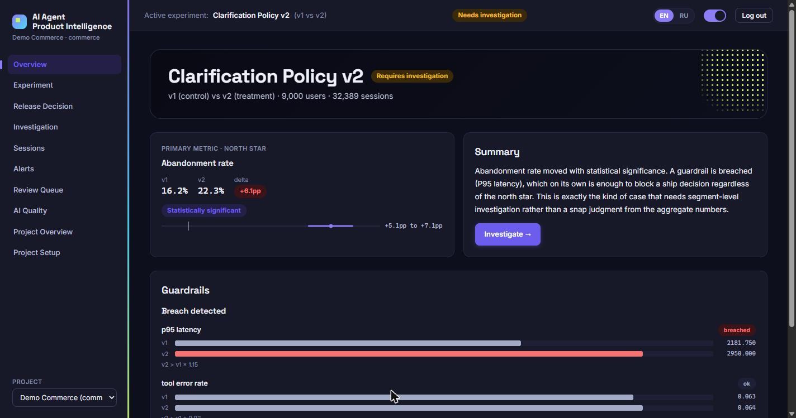
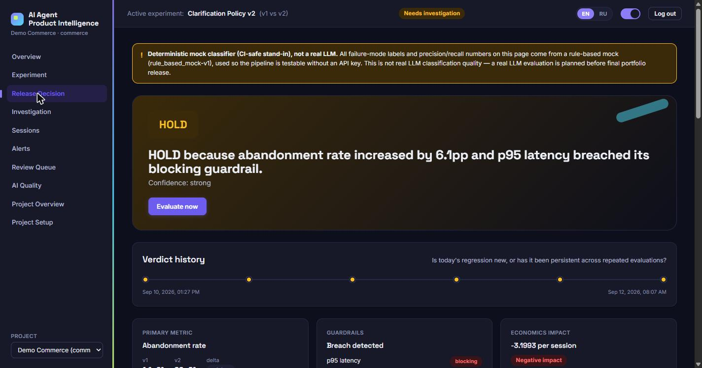
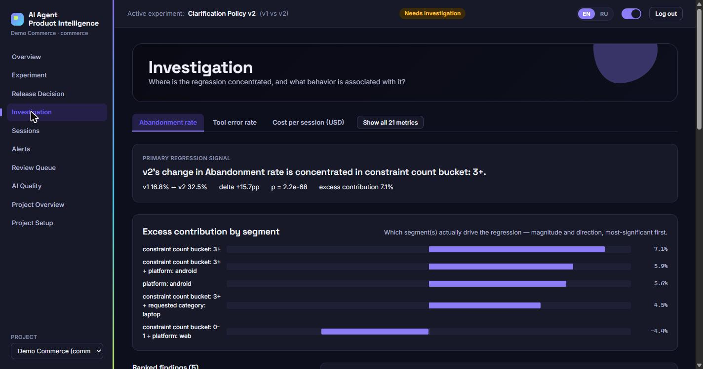
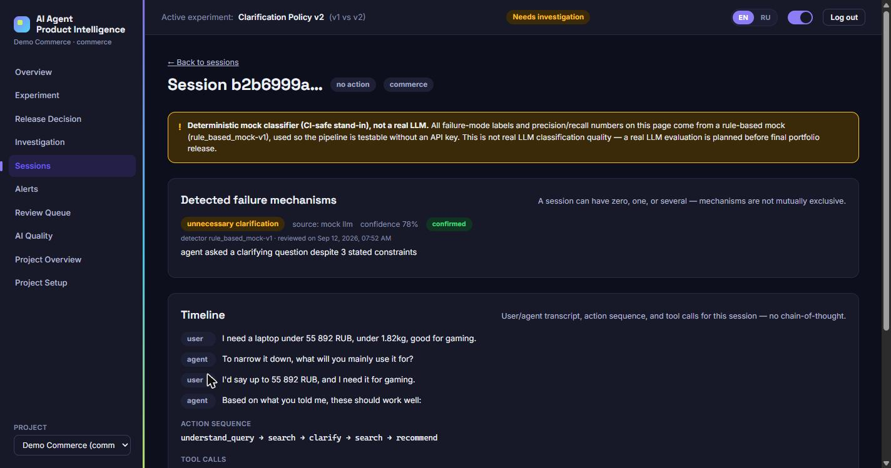
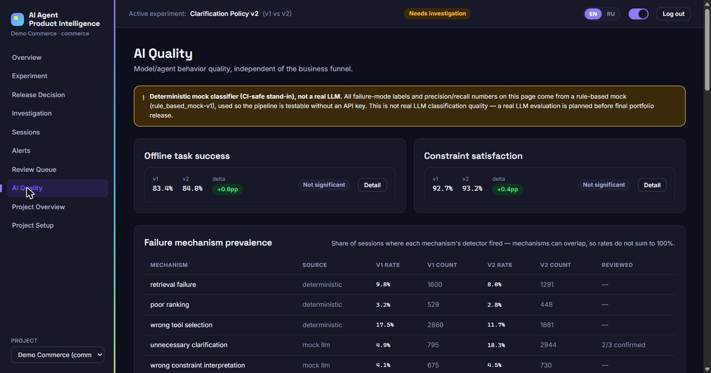
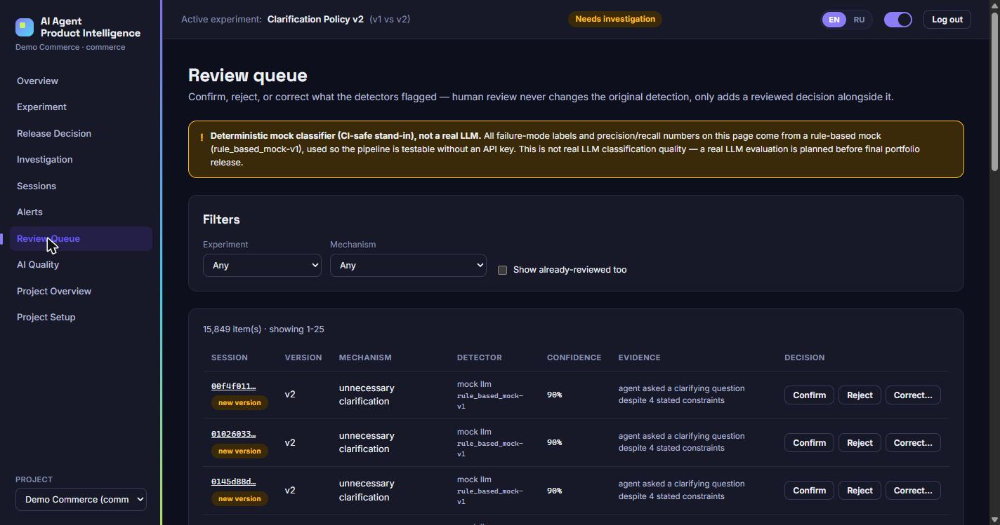
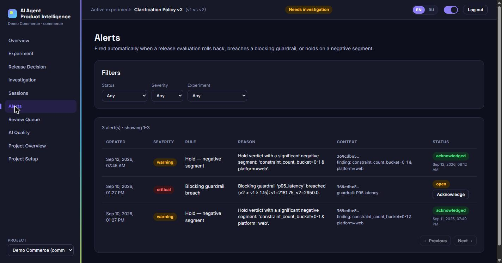
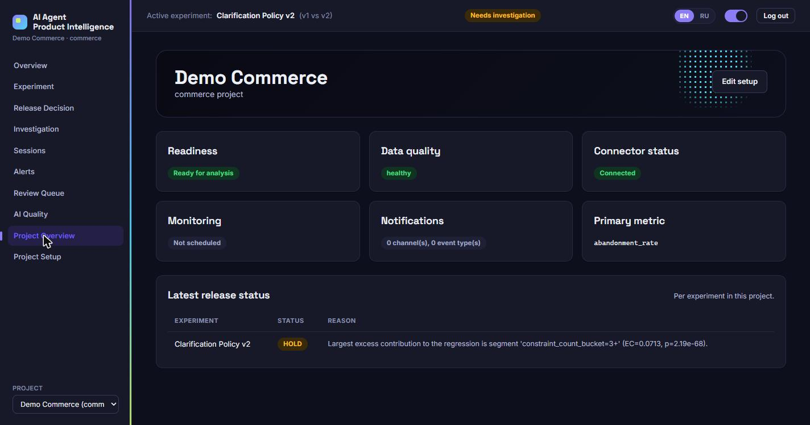
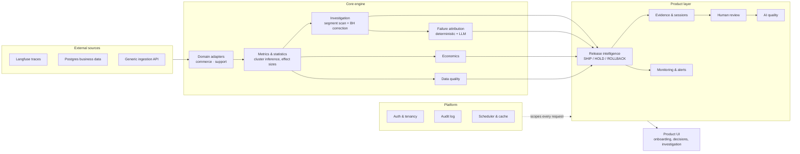

# AI Agent Product Intelligence

*[Читать на русском](README.ru.md)*

**Release intelligence for AI agents.** Connect agent behavior, release experiments, business outcomes, economics, and human feedback into one place, so an AI product team can answer — with evidence, not a hunch — *did the new version actually improve the product, and should we ship it?*

**Built for:** AI product managers, ML/product analysts, and AI platform teams who ship new agent or model versions regularly and need a repeatable, defensible way to decide **SHIP / HOLD / ROLLBACK** — not just a dashboard of traces and token counts.



## The problem

Most teams shipping an AI agent already have observability: traces, tool calls, latency, token spend, error rates. What they don't have is the next step — turning "the agent's behavior changed" into "here's what that did to the product, here's the evidence, here's what we should do about it."

An aggregate readout is rarely enough on its own. Conversion can look flat while a specific user segment quietly regresses. A guardrail can breach for a reason the headline metric never shows. Teams end up either shipping on a misleadingly calm aggregate, or holding back releases that are actually fine, because nobody can cheaply answer *where did it regress, why, and how sure are we?*

## What the platform does

AI Agent Product Intelligence connects the full chain — **agent behavior → release comparison → statistical investigation → evidence → decision → ongoing monitoring** — so a release decision is always backed by a segment, a mechanism, and a real session, not a gut call on an aggregate number.

```
data in  →  configure metrics & guardrails  →  compare a release  →  regression detected
        →  investigate (segments, mechanisms, evidence)  →  SHIP / HOLD / ROLLBACK
        →  monitor continuously  →  alert on regression  →  human review of AI attribution
```

## Core capabilities

- **Release intelligence** — a deterministic SHIP / HOLD / ROLLBACK decision for every release evaluation, with the full evidence trail behind it, and a history of how the verdict evolved over time.
- **Product & business metrics** — conversion, abandonment, funnel, cost, and revenue, computed with the statistical rigor of a real experiment (cluster-aware significance testing, confidence intervals, effect sizes), not just a dashboard average.
- **Automated investigation** — a bounded, pre-registered segment scan (never an open-ended fishing expedition) with multiple-testing correction, surfacing exactly where a regression concentrates.
- **Guardrails** — latency, cost, and error-rate thresholds that can block a confident SHIP regardless of how good the headline metric looks.
- **AI failure attribution** — a hybrid deterministic + LLM pipeline that tags *why* a session went wrong, from a fixed, auditable taxonomy.
- **Representative-session evidence** — every finding links to real sessions and transcripts, so a reviewer can sanity-check the automated conclusion against raw evidence in one click.
- **Economics** — cost-per-session and estimated business impact attached to the same release decision, not a separate spreadsheet.
- **Data quality gating** — a release with unreliable underlying data cannot be reported as a confident SHIP.
- **Monitoring windows & alerts** — scheduled release checks that fire an alert on a rollback, a guardrail breach, or a significant negative segment.
- **Human review & AI-quality feedback loop** — confirm, reject, or correct any AI-flagged attribution; review outcomes feed a calibration signal on classifier quality.
- **Multi-project, multi-domain** — the same engine runs commerce and support agents side by side, each with its own metrics, guardrails, and data.
- **Langfuse + Postgres integrations** — bring in agent traces and business outcomes from the systems teams already use.

## Product workflow

1. **Connect data** — ingest sessions from Langfuse, a Postgres business database, or the generic ingestion API.
2. **Configure metrics & guardrails** — pick a primary metric, guardrail thresholds, and segment dimensions for the project's domain.
3. **Monitor a release** — compare a new agent version against the current one on the metrics that matter.
4. **Detect a regression** — an aggregate guardrail breach or a flat-but-suspicious north star opens an investigation.
5. **Investigate segments & mechanisms** — a bounded scan finds where the regression concentrates and which behavior is associated with it.
6. **Inspect evidence** — drill into the real sessions behind a finding.
7. **SHIP / HOLD / ROLLBACK** — a deterministic rule table turns the evidence into a verdict, never an LLM judgment call.
8. **Review AI attribution quality** — confirm, reject, or correct what the detectors flagged, closing the loop on classifier trust.

## Screens

**Release Decision** — the verdict, prominently, with the deterministic reason, guardrail status, economics impact, and verdict history over time.



**Investigation** — where the regression concentrates, ranked by excess contribution, down to the mechanism behind it.



**Session Detail** — the real evidence behind a finding: transcript, action sequence, tool calls, and the detected failure mechanism with its provenance.



**AI Quality** — model/agent behavior quality on its own terms, always paired with an outcome, never presented as an end in itself.



**Review Queue** — confirm, reject, or correct any AI-flagged attribution without ever silently changing the original detection.



**Alerts** — fired automatically on a rollback, a blocking guardrail breach, or a hold on a significant negative segment.



**Project Overview** — a project's health at a glance: readiness, data quality, connector status, monitoring, and the latest release status per experiment.



## Why this is different from generic LLM observability

A tracing tool tells you what the agent did. This platform tells you what that did to the product:

- **Links AI behavior to product and business outcomes** — every AI-quality metric is wired to a downstream conversion, retention, or cost metric, not shown in isolation.
- **Release-level decisioning, not trace inspection** — the unit of work is "should we ship this version," not "let me page through spans."
- **Statistical investigation, not eyeballing a chart** — cluster-aware significance testing and multiple-testing correction stand between a noisy metric and a claimed "finding."
- **Evidence-backed findings** — every claim traces to a segment, a mechanism, and real sessions a reviewer can open.
- **Economics attached to the decision** — cost and business impact live next to the verdict, not in a separate report.
- **Human-reviewed AI quality** — attribution quality is measured against real reviewer decisions, not just an offline benchmark nobody revisits.

## Architecture



External agent and business data flows in through **domain adapters**, which normalize commerce, support, or any future domain into one shared shape for the **metrics, investigation, and attribution engines**. Those feed the **product layer** — release decisions, evidence, monitoring, human review, and AI quality — all scoped per project/organization by the **platform layer** (auth, audit, scheduling, caching), and surfaced through one **product UI**.

## AI quality and trust

- **Hybrid attribution, not one big model call.** Three failure mechanisms (`retrieval_failure`, `poor_ranking`, `wrong_tool_selection`) are recovered deterministically from structured session data — no model guessing what's already computable. Three more (`unnecessary_clarification`, `wrong_constraint_interpretation`, `unsupported_product_claim`) require reading conversational context and go to one real LLM call per session, answering all three independently — never forced into a single label.
- **Current benchmark (the one that matters):** a 200-session held-out set, disjoint from development data and never resampled after seeing predictions.

  | Mechanism | Type | Precision | Recall | F1 |
  |---|---|---|---|---|
  | retrieval_failure | deterministic | 1.00 | 1.00 | 1.00 |
  | poor_ranking | deterministic | 1.00 | 1.00 | 1.00 |
  | wrong_tool_selection | deterministic | 1.00 | 1.00 | 1.00 |
  | unnecessary_clarification | semantic (LLM) | 0.84 | 0.98 | 0.90 |
  | wrong_constraint_interpretation | semantic (LLM) | 0.72 | 1.00 | 0.84 |
  | unsupported_product_claim | semantic (LLM) | 0.97 | 0.97 | 0.97 |

  Semantic aggregate: micro-F1 0.90, macro-F1 0.90, exact-match ratio 0.88, Hamming loss 0.045. Provider: OpenRouter, `anthropic/claude-sonnet-5`, prompt `semantic_attribution_v1`, detector `deterministic_detectors_v1`. All acceptance bars met. The deterministic detectors scoring a perfect 1.0 is expected, not a red flag — they're pure functions of structured fields this synthetic dataset's generator computed with the identical rule used for ground truth; it validates the detector's logic, not performance against noisier real telemetry.
- **The old exclusive single-label classifier is deprecated and archived** — it forced overlapping mechanisms to compete for one label and is never presented as current performance. See `docs/AI_EVALUATION.md` for the historical numbers, clearly marked as superseded.
- **Human review is a separate, production-facing quality signal.** Every AI-flagged attribution can be confirmed, rejected, or corrected by a reviewer without ever modifying the original detection — confirmation/correction rates and confidence-calibration are reported per detector, gated behind a minimum sample size so a handful of reviews never masquerades as a precise number.
- **Mock-classifier provenance is never hidden.** Every screen that shows classifier output — including Review Queue and Release Decision — discloses when the active classifier is the deterministic CI-safe mock rather than a live LLM.
- **Ground truth is physically isolated.** The synthetic dataset's planted-effect answer key lives in a file the application database never contains — not excluded by convention, but structurally absent — so no code path can read it by accident.
- **Data quality gates the decision.** A project with critical data-quality issues cannot return a confident SHIP; the verdict is downgraded to HOLD until quality clears.
- **No silent model-driven release decisions.** SHIP/HOLD/ROLLBACK comes from a fixed, auditable rule table over already-computed numbers — never an LLM's judgment call.

## Example result

On the demo commerce dataset, a release named **Clarification Policy v2** looks broadly acceptable in aggregate — conversion is flat, not statistically significant. Investigation tells a different story: abandonment is significantly worse for v2 (16.2% → 22.3%, statistically significant), concentrated in constraint-heavy requests, where v2 asks unnecessary clarifying questions even after the user already gave enough detail. Independently, p95 latency on this version breaches its blocking guardrail (2,182ms → 2,950ms). With a breached guardrail and a significant negative segment, the deterministic decision rule returns **HOLD** — not ship, not rollback — with the exact segment, mechanism, and representative sessions attached as evidence.

## Integrations

- **Langfuse** brings in agent traces, tool calls, and model behavior from the observability stack teams already run.
- **Postgres** brings in business outcomes and economics — orders, revenue, cost — from the systems that already hold them.
- Both flow into the same domain-adapter layer and the same release-analysis pipeline, so a release decision is never built from just one side of the story.

## Multi-domain proof

The platform ships with two reference domains — **commerce** (a conversational shopping agent) and **support** (a conversational support agent) — deliberately different enough (different metrics, different guardrails, different segment dimensions) to demonstrate that nothing is hardcoded to one shape of product. A new domain is a new adapter, not a rewrite.

## Technology

**Backend:** FastAPI, Pydantic v2, SQLAlchemy 2.0, Alembic, PostgreSQL 16, pandas/numpy/scipy/statsmodels for statistics, JWT + bcrypt auth.
**Frontend:** React 19, TypeScript, Vite, React Router, TanStack Query, i18next (English/Russian).
**LLM:** a protocol-based client abstraction — a deterministic rule-based mock (CI-safe, no API key required) and a real OpenRouter-backed client, swappable without touching the pipeline.
**Testing:** pytest (backend), Vitest + React Testing Library (frontend unit), Playwright (end-to-end).

## Running locally

**Backend** (from repo root):
```bash
python -m venv .venv && .venv/Scripts/activate      # or source .venv/bin/activate
pip install -e ".[dev]"

docker run -d --name ai_agent_pi_postgres -p 5434:5432 \
  -e POSTGRES_USER=app -e POSTGRES_PASSWORD=app_password -e POSTGRES_DB=ai_agent_pi \
  postgres:16-alpine

python -m alembic upgrade head
python -m datagen.generate --profile demo --seed 2024
python -m datagen.load_to_postgres --profile demo
python -m scripts.run_classification --client mock

AIPI_WARMUP_ON_STARTUP=1 uvicorn backend.app.main:app --port 8123
```

**Frontend** (from `frontend/`):
```bash
npm install
npm run dev        # http://localhost:5173
```

**Tests**:
```bash
pytest                             # backend
cd frontend && npm run test        # frontend unit
cd frontend && npx playwright install chromium && npm run test:e2e   # end-to-end
```

## Current scope and limitations

- Deployed as a self-hosted, single-tenant-per-deployment product today, not a hosted multi-customer SaaS — organizations and projects are fully isolated within one deployment, but connector credentials are configured at the deployment level, not per-customer.
- The first analysis after a cold start (no warm cache) recomputes statistics and can take up to roughly a minute for a large experiment; subsequent requests are served from a per-project cache that invalidates automatically on new data.
- Human-review-based quality signals need a minimum number of reviewed examples before they're reported as a rate rather than "not enough data yet" — this is a deliberate honesty guard, not a missing feature.
- The demo dataset is synthetic, generated with known planted effects specifically so the investigation engine's findings can be checked against a real answer key.
