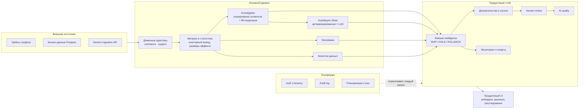

# AI Agent Product Intelligence

*[Read in English](README.md)*

**Продуктовая аналитика релизов для AI-агентов.** Объединяет поведение агента, релизные эксперименты, бизнес-метрики, экономику и обратную связь от людей в одном месте — чтобы продуктовая команда могла ответить, опираясь на доказательства, а не на догадку: *действительно ли новая версия улучшила продукт, и стоит ли её выкатывать?*

**Для кого:** AI product-менеджеры, продуктовые/ML-аналитики и AI-платформенные команды, которые регулярно выкатывают новые версии агентов или моделей и которым нужен повторяемый, обоснованный способ принимать решение **SHIP / HOLD / ROLLBACK** — а не просто дашборд трейсов и счётчиков токенов.


## Проблема

У большинства команд, выкатывающих AI-агента, уже есть observability: трейсы, вызовы инструментов, латентность, расход токенов, частота ошибок. Чего у них нет — следующего шага: превратить «поведение агента изменилось» в «вот что это дало продукту, вот доказательства, вот что делать дальше».

Агрегированной сводки почти никогда не достаточно. Конверсия может выглядеть ровной, пока конкретный сегмент пользователей тихо деградирует. Guardrail может быть нарушен по причине, которую заголовочная метрика вообще не показывает. В итоге команды либо выкатывают релиз, полагаясь на обманчиво спокойный агрегат, либо придерживают вполне нормальные релизы — просто потому, что никто не может дёшево ответить на вопрос: *где именно регрессия, почему, и насколько мы в этом уверены?*

## Что делает платформа

AI Agent Product Intelligence связывает всю цепочку — **поведение агента → сравнение релиза → статистическое расследование → доказательства → решение → непрерывный мониторинг** — так что релизное решение всегда подкреплено сегментом, механизмом и реальной сессией, а не интуитивной оценкой агрегированного числа.

```
данные  →  настройка метрик и guardrail'ов  →  сравнение релиза  →  обнаружена регрессия
        →  расследование (сегменты, механизмы, доказательства)  →  SHIP / HOLD / ROLLBACK
        →  непрерывный мониторинг  →  алерт при регрессии  →  human review AI-атрибуции
```

## Ключевые возможности

- **Release intelligence** — детерминированное решение SHIP / HOLD / ROLLBACK для каждой релизной оценки, с полной цепочкой доказательств и историей того, как менялся вердикт со временем.
- **Продуктовые и бизнес-метрики** — конверсия, отток, воронка, стоимость и выручка, вычисленные со статистической строгостью настоящего эксперимента (тесты значимости с учётом кластеризации, доверительные интервалы, размеры эффекта), а не просто усреднение для дашборда.
- **Автоматическое расследование** — ограниченное, заранее зарегистрированное сканирование сегментов (никогда не открытый перебор наугад) с поправкой на множественное тестирование, точно показывающее, где концентрируется регрессия.
- **Guardrail'ы** — пороги по латентности, стоимости и частоте ошибок, которые могут заблокировать уверенный SHIP независимо от того, насколько хорошо выглядит заголовочная метрика.
- **AI-атрибуция сбоев** — гибридный пайплайн (детерминированные правила + LLM), который помечает, *почему* конкретная сессия пошла не так, из фиксированной, проверяемой таксономии.
- **Доказательства на уровне сессий** — каждая находка ссылается на реальные сессии и транскрипты, чтобы ревьюер мог за один клик сверить автоматический вывод с исходными данными.
- **Экономика** — стоимость на сессию и оценка влияния на бизнес прикреплены к тому же релизному решению, а не живут в отдельной таблице.
- **Контроль качества данных** — релиз с ненадёжными исходными данными не может быть представлен как уверенный SHIP.
- **Окна мониторинга и алерты** — плановые проверки релиза, которые запускают алерт при rollback, нарушении guardrail'а или значимом негативном сегменте.
- **Human review и цикл обратной связи по качеству AI** — подтверждение, отклонение или исправление любой AI-атрибуции; результаты ревью формируют сигнал калибровки качества классификатора.
- **Мульти-проект, мульти-домен** — один и тот же движок одновременно обслуживает агентов e-commerce и поддержки, у каждого свои метрики, guardrail'ы и данные.
- **Интеграции с Langfuse и Postgres** — данные приходят из систем, которыми команды уже пользуются.

## Продуктовый workflow

1. **Подключить данные** — загрузить сессии из Langfuse, бизнес-базы Postgres или через generic ingestion API.
2. **Настроить метрики и guardrail'ы** — выбрать основную метрику, пороги guardrail'ов и измерения сегментации для домена проекта.
3. **Мониторить релиз** — сравнить новую версию агента с текущей по релевантным метрикам.
4. **Обнаружить регрессию** — нарушение guardrail'а в агрегате или подозрительно ровная north-star метрика открывают расследование.
5. **Расследовать сегменты и механизмы** — ограниченное сканирование находит, где концентрируется регрессия и с каким поведением она связана.
6. **Изучить доказательства** — провалиться в реальные сессии, стоящие за находкой.
7. **SHIP / HOLD / ROLLBACK** — детерминированная таблица правил превращает доказательства в вердикт, никогда не решение LLM.
8. **Проверить качество AI-атрибуции** — подтвердить, отклонить или исправить то, что пометили детекторы, замыкая цикл доверия к классификатору.

## Экраны

**Release Decision** — вердикт, на первом плане, с детерминированной причиной, статусом guardrail'ов, влиянием на экономику и историей вердиктов во времени.


**Investigation** — где концентрируется регрессия, ранжировано по избыточному вкладу, вплоть до механизма, который за ней стоит.


**Session Detail** — реальные доказательства за находкой: транскрипт, последовательность действий, вызовы инструментов и обнаруженный механизм сбоя с указанием провенанса.


**AI Quality** — качество поведения модели/агента само по себе, всегда в паре с исходом, никогда не представлено как самоцель.


**Review Queue** — подтвердить, отклонить или исправить любую AI-атрибуцию, никогда не изменяя исходное обнаружение незаметно.


**Alerts** — срабатывают автоматически при rollback, нарушении блокирующего guardrail'а или hold из-за значимого негативного сегмента.


**Project Overview** — здоровье проекта одним взглядом: готовность, качество данных, статус коннектора, мониторинг и последний релизный статус по каждому эксперименту.


## Чем это отличается от обычного LLM observability

Инструмент трейсинга говорит, что сделал агент. Эта платформа говорит, что это дало продукту:

- **Связывает поведение AI с продуктовыми и бизнес-исходами** — каждая AI-метрика привязана к нижестоящей метрике конверсии, удержания или стоимости, а не показана изолированно.
- **Решения на уровне релиза, а не разбор трейсов** — единица работы — «стоит ли выкатывать эту версию», а не «пролистать спаны».
- **Статистическое расследование, а не взгляд на график** — тесты значимости с учётом кластеризации и поправка на множественное тестирование стоят между шумной метрикой и заявленной «находкой».
- **Находки, подкреплённые доказательствами** — каждое утверждение сводится к сегменту, механизму и реальным сессиям, которые ревьюер может открыть.
- **Экономика привязана к решению** — стоимость и влияние на бизнес живут рядом с вердиктом, а не в отдельном отчёте.
- **AI-качество, проверенное людьми** — качество атрибуции измеряется по реальным решениям ревьюеров, а не только по офлайн-бенчмарку, к которому никто не возвращается.

## Архитектура



Внешние данные об агенте и бизнесе поступают через **доменные адаптеры**, которые приводят commerce, support или любой будущий домен к единой форме для **движков метрик, расследования и атрибуции**. Они питают **продуктовый слой** — релизные решения, доказательства, мониторинг, human review и AI quality — всё это ограничено рамками проекта/организации **платформенным слоем** (auth, audit, планирование, кэширование) и представлено через единый **продуктовый UI**.

## Качество AI и доверие

- **Гибридная атрибуция, а не один большой вызов модели.** Три механизма сбоя (`retrieval_failure`, `poor_ranking`, `wrong_tool_selection`) восстанавливаются детерминированно из структурированных данных сессии — модель не угадывает то, что уже вычислимо. Ещё три (`unnecessary_clarification`, `wrong_constraint_interpretation`, `unsupported_product_claim`) требуют понимания контекста диалога и уходят в один реальный вызов LLM на сессию, отвечающий на все три вопроса независимо — никогда не сведённый к одной метке.
- **Текущий бенчмарк (тот, который имеет значение):** набор из 200 held-out сессий, не пересекающийся с данными разработки и ни разу не пересэмплированный после получения предсказаний.

  | Механизм | Тип | Precision | Recall | F1 |
  |---|---|---|---|---|
  | retrieval_failure | детерминированный | 1.00 | 1.00 | 1.00 |
  | poor_ranking | детерминированный | 1.00 | 1.00 | 1.00 |
  | wrong_tool_selection | детерминированный | 1.00 | 1.00 | 1.00 |
  | unnecessary_clarification | семантический (LLM) | 0.84 | 0.98 | 0.90 |
  | wrong_constraint_interpretation | семантический (LLM) | 0.72 | 1.00 | 0.84 |
  | unsupported_product_claim | семантический (LLM) | 0.97 | 0.97 | 0.97 |

  Агрегат по семантическим механизмам: micro-F1 0.90, macro-F1 0.90, exact-match ratio 0.88, Hamming loss 0.045. Провайдер: OpenRouter, `anthropic/claude-sonnet-5`, промпт `semantic_attribution_v1`, версия детектора `deterministic_detectors_v1`. Все пороги приёмки пройдены. То, что детерминированные детекторы показывают идеальную единицу — ожидаемо, а не тревожный сигнал: это чистые функции от структурированных полей, которые генератор этого синтетического датасета вычислил по тому же правилу, что и ground truth; это подтверждает корректность логики детектора, а не производительность на более шумной реальной телеметрии.
- **Старый эксклюзивный однометочный классификатор устарел и заархивирован** — он заставлял пересекающиеся механизмы конкурировать за одну метку и никогда не представляется как текущая производительность. См. `docs/AI_EVALUATION.md` для исторических цифр, явно помеченных как устаревшие.
- **Human review — отдельный, продакшн-ориентированный сигнал качества.** Любую AI-атрибуцию ревьюер может подтвердить, отклонить или исправить, никогда не изменяя исходное обнаружение — частота подтверждений/исправлений и калибровка уверенности отчитываются по каждому детектору, с ограничением по минимальному размеру выборки, чтобы горстка ревью не выдавалась за точное число.
- **Провенанс mock-классификатора никогда не скрывается.** Каждый экран, показывающий вывод классификатора — включая Review Queue и Release Decision — раскрывает, когда активный классификатор является детерминированным CI-safe mock, а не живой LLM.
- **Ground truth физически изолирован.** Ответы для проверки синтетического датасета живут в файле, которого приложение никогда не содержит в своей базе данных — не исключены по договорённости, а структурно отсутствуют, так что ни один код не может прочитать их случайно.
- **Качество данных блокирует решение.** Проект с критическими проблемами качества данных не может получить уверенный SHIP; вердикт понижается до HOLD, пока качество не восстановится.
- **Никаких скрытых решений релиза от модели.** SHIP/HOLD/ROLLBACK — из фиксированной, проверяемой таблицы правил над уже вычисленными числами, никогда не из суждения LLM.

## Пример результата

На демо-датасете commerce релиз с именем **Clarification Policy v2** выглядит в целом приемлемо в агрегате — конверсия ровная, статистически незначимая. Расследование рассказывает другую историю: показатель отказа от сессии значимо хуже для v2 (16.2% → 22.3%, статистически значимо), сконцентрирован в запросах с большим числом ограничений, где v2 задаёт лишние уточняющие вопросы даже после того, как пользователь уже дал достаточно деталей. Независимо от этого, p95-латентность на этой версии нарушает блокирующий guardrail (2182 мс → 2950 мс). При нарушенном guardrail'е и значимом негативном сегменте детерминированное правило решения возвращает **HOLD** — не ship, не rollback — с точным сегментом, механизмом и репрезентативными сессиями, приложенными как доказательства.

## Интеграции

- **Langfuse** приносит трейсы агента, вызовы инструментов и поведение модели из observability-стека, которым команды уже пользуются.
- **Postgres** приносит бизнес-исходы и экономику — заказы, выручку, затраты — из систем, которые уже их хранят.
- Оба источника попадают в один и тот же слой доменных адаптеров и один и тот же пайплайн анализа релиза, так что релизное решение никогда не строится только на одной стороне истории.

## Доказательство мультидоменности

Платформа поставляется с двумя референсными доменами — **commerce** (диалоговый шоппинг-агент) и **support** (диалоговый агент поддержки) — намеренно разными (разные метрики, разные guardrail'ы, разные измерения сегментации), чтобы показать, что ничего не зашито под одну форму продукта. Новый домен — это новый адаптер, а не переписывание системы.

## Технологии

**Backend:** FastAPI, Pydantic v2, SQLAlchemy 2.0, Alembic, PostgreSQL 16, pandas/numpy/scipy/statsmodels для статистики, JWT + bcrypt для аутентификации.
**Frontend:** React 19, TypeScript, Vite, React Router, TanStack Query, i18next (английский/русский).
**LLM:** абстракция клиента на основе протокола — детерминированный rule-based mock (CI-safe, без API-ключа) и реальный клиент на базе OpenRouter, взаимозаменяемые без изменения пайплайна.
**Тестирование:** pytest (backend), Vitest + React Testing Library (frontend unit), Playwright (end-to-end).

## Запуск локально

**Backend** (из корня репозитория):
```bash
python -m venv .venv && .venv/Scripts/activate      # или source .venv/bin/activate
pip install -e ".[dev]"

docker run -d --name ai_agent_pi_postgres -p 5434:5432 \
  -e POSTGRES_USER=app -e POSTGRES_PASSWORD=app_password -e POSTGRES_DB=ai_agent_pi \
  postgres:16-alpine

python -m alembic upgrade head
python -m datagen.generate --profile demo --seed 2024
python -m datagen.load_to_postgres --profile demo
python -m scripts.run_classification --client mock

AIPI_WARMUP_ON_STARTUP=1 uvicorn backend.app.main:app --port 8123
```

**Frontend** (из `frontend/`):
```bash
npm install
npm run dev        # http://localhost:5173
```

**Тесты**:
```bash
pytest                             # backend
cd frontend && npm run test        # frontend unit
cd frontend && npx playwright install chromium && npm run test:e2e   # end-to-end
```

## Текущий охват и ограничения

- Сегодня продукт разворачивается как self-hosted, с одним деплоем на организацию, а не как размещённый multi-customer SaaS — организации и проекты полностью изолированы внутри одного деплоя, но учётные данные коннекторов настраиваются на уровне деплоя, а не на уровне отдельного клиента.
- Первый анализ после холодного старта (без прогретого кэша) пересчитывает статистику и может занять до примерно минуты для крупного эксперимента; последующие запросы обслуживаются из кэша на уровне проекта, который автоматически инвалидируется при поступлении новых данных.
- Сигналам качества на основе human review нужно минимальное количество проверенных примеров, прежде чем они отчитываются как процент, а не «недостаточно данных» — это осознанная защита от вводящих в заблуждение цифр, а не недостающая функциональность.
- Демо-датасет синтетический, сгенерирован с заранее заданными эффектами специально для того, чтобы находки движка расследования можно было сверить с реальным ответом.
