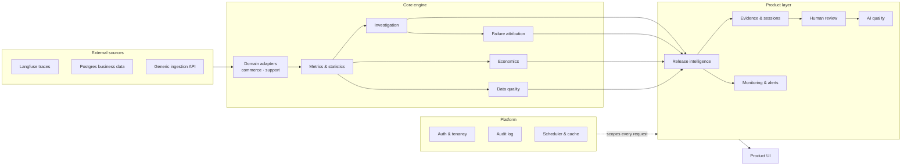

# Architecture

## 1. System overview



One backend service (FastAPI), one frontend service (React/Vite), one PostgreSQL database, and an offline synthetic-data generator invoked as a CLI (not a running service). No message queue, no separate microservice for LLM calls — attribution runs as a batch pipeline inside the backend, writing to a table the request path only ever reads from.

## 2. Why this shape

- **One backend, organized by module boundary, not process boundary.** Analytics, investigation, attribution, economics, and data-quality logic are internal Python packages under one FastAPI app. This keeps deployment simple (two services plus Postgres) without losing separation of concerns in the code.
- **Domain adapters, not domain-specific routers.** A generic API (`/api/v1/domains/{domain}/...`) is parameterized by domain; each domain (commerce, support) supplies its own metric registry, guardrails, and segment dimensions through an adapter interface. Adding a domain means writing an adapter, not duplicating routes, statistics, or the investigation engine.
- **Metrics computed on read where the data size allows, cached where it doesn't.** Most metrics are query functions over indexed tables, fast enough to compute per request at the project's data scale. Investigation's segment scan and the full metric table are cached per project, keyed by a data-version counter that increments on every write — so new data invalidates the cache automatically instead of requiring a restart.
- **Investigation runs synchronously**, not as a background job with polling. A bounded, pre-registered scan (on the order of tens of statistical tests per run) completes in seconds once cached, and in well under a minute cold — a "click Investigate → loading state → results" UX is honest at this scale.
- **Failure attribution is pre-computed, not live-on-click.** Classification runs once per session at ingestion/classification time; the Investigation and AI Quality screens read the cached result table. This keeps interactive screens fast and keeps LLM cost bounded and predictable.
- **Release decisions are deterministic.** A fixed, auditable rule table over already-computed numbers decides SHIP/HOLD/ROLLBACK — never an LLM call in the decision path — so the same stored evaluation always produces the same verdict and the same explanation text.

## 3. Tech stack and rationale

| Layer | Choice | Why |
|---|---|---|
| Backend framework | FastAPI + Pydantic v2 | Typed request/response models double as API documentation; async-capable where it matters (LLM calls) without forcing it everywhere. |
| ORM / migrations | SQLAlchemy 2.0 + Alembic | Schema-as-code with a real, evolving migration history. |
| Database | PostgreSQL 16 | Window functions, `jsonb`, and CTEs are used throughout the analytics layer. |
| Analytics | SQLAlchemy Core (raw SQL) for queries, pandas for post-processing | SQL for what SQL expresses cleanly; pandas/scipy/statsmodels for cluster-level statistics and bootstrap resampling. |
| Statistics | scipy.stats, statsmodels | Standard, checkable implementations — see `STATISTICS.md`. |
| Auth | PyJWT (short-lived access tokens + rotating, hashed refresh tokens) + bcrypt password hashing | Stateless access tokens for request-path performance; revocable refresh tokens for real logout/session control. |
| LLM | An `LLMClient` protocol with an OpenRouter-backed implementation and a deterministic rule-based mock | One abstraction, two implementations — the mock is CI-safe and requires no API key; swapping to real LLM output changes zero downstream code. |
| Frontend | React 19 + TypeScript + Vite + React Router | Fast dev iteration, standard routing, no framework lock-in beyond React itself. |
| Data fetching | TanStack Query | Caching, invalidation, and loading/error state without hand-rolled fetch logic. |
| Localization | i18next | English and Russian UI copy from the same component tree. |
| Testing | pytest (backend), Vitest + React Testing Library (frontend unit), Playwright (end-to-end) | Layered coverage: statistics/logic unit tests, API integration tests against a real test database, frontend component tests, and a real-browser end-to-end suite against the live stack. |

## 4. Request flow for the core scenario (release evaluation)

1. Frontend requests `POST /api/v1/domains/{domain}/experiments/{id}/release-evaluations`.
2. The backend resolves the caller's project/organization membership (`get_project_context`) before touching any domain data — every domain-scoped route requires this, not just a `project_id` query parameter taken on faith.
3. The domain adapter loads session-level data for both arms and computes the metric table, guardrail checks, and (if triggered) the bounded segment scan, with cluster-aware statistics throughout (`STATISTICS.md`).
4. Pre-computed failure-attribution rows are joined in for the top segments; economics and data-quality status are attached.
5. A deterministic rule table (`backend/investigation/recommend.py`) turns the assembled evidence into a verdict, and a template function (`backend/release/summary.py`) renders the explanation sentence — no LLM in either step.
6. The evaluation, its evidence, and the generated alerts (if any) are persisted; an audit-log entry is written for the mutation.
7. The frontend renders the verdict, evidence hierarchy, guardrails, economics, and representative sessions from one response.

## 5. Repository structure

```
AI_agent_product_intelligence/
├── docs/                      # this document set
├── datagen/                   # seeded synthetic-data generator (demo/dev datasets)
├── backend/
│   ├── app/
│   │   ├── main.py             # FastAPI app, router mounting, CORS, error handlers
│   │   ├── routers/            # auth, domains (generic per-domain API), ai_quality,
│   │   │                       # ingestion, alerts, review, monitoring, notifications,
│   │   │                       # audit, ops, langfuse_connector, postgres_business_connector
│   │   ├── schemas/             # Pydantic request/response models
│   │   ├── auth_deps.py         # authentication + project/org ownership dependencies
│   │   └── dependencies.py
│   ├── auth/                   # password hashing, tokens, org/project/membership service
│   ├── domains/                # commerce/ and support/ domain adapters
│   ├── analytics/              # metric queries + statistics (clustering, bootstrap, correction)
│   ├── investigation/           # segment scan, scoring, attribution, recommendation
│   ├── llm/                     # LLMClient protocol, OpenRouter client, mock client, prompts
│   ├── release/                 # release-evaluation service and evidence assembly
│   ├── review/                  # human review of AI attributions + quality metrics
│   ├── quality/                 # data-quality checks
│   ├── economics/               # cost/impact computation
│   ├── connectors/              # langfuse/ and postgres_business/ ingestion connectors
│   ├── monitoring/              # scheduled monitoring jobs + leasing
│   ├── notifications/           # notification channels/rules
│   ├── audit/                   # audit log
│   └── project_config/          # per-project metric/guardrail/segment configuration
├── frontend/
│   ├── src/
│   │   ├── pages/               # Overview, Experiment, ReleaseDecision, Investigation,
│   │   │                        # Sessions, SessionDetail, AIQuality, Alerts, ReviewQueue,
│   │   │                        # ProjectOverview, onboarding/, Login, Register, Landing
│   │   ├── state/                # auth, active project/experiment, theme, language contexts
│   │   ├── api/                  # typed API client + TanStack Query hooks
│   │   └── i18n/                 # English/Russian locale files
│   └── e2e/                      # Playwright end-to-end suite
├── tests/                        # backend integration tests + ground-truth validation
├── scripts/                      # CLI tools: classification runs, connector imports, benchmarks
└── alembic/                      # database migrations
```

## 6. Cross-cutting conventions

- Every number the frontend renders comes from a typed backend field, never computed client-side beyond formatting.
- Every domain-scoped route verifies project/organization membership before returning data — a `project_id` is never trusted as a bare filter.
- All timestamps are stored and computed in UTC.
- Configuration (database URL, JWT secret, LLM provider/model, connector credentials) is read from environment variables at startup; a non-production JWT secret is refused outside development/test environments.
